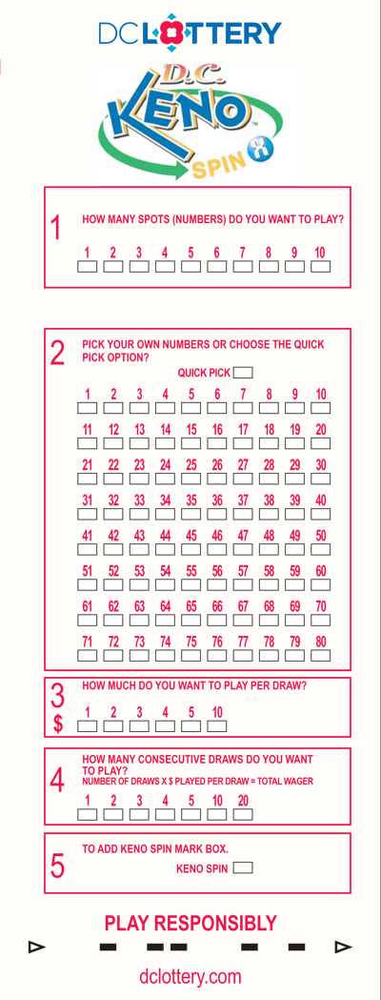

CS 240: Computer Science II
===========================

Final Project
-------------

Assigned: 2013-12-03

Due: 2013-12-06

### Description

News of your Keno simuluation prowess has spread, and a group of investors
(read gamblers) has approached you, to enlist your skills. They want you to
verify the information on the back of a Keno slip, and to help them choose
a bettors plan of action.

### Assignment

1. Different "Spot Games" have different winning conditions. In all cases,
matching every number picked results in a win. In some cases, a win can come
with fewer matches or even zero matches. Design and run the Keno simulation(s)
that will confirm or refute the "Overall Odds" values listed with each spot
game under the "Prizes and Odds" section of a Keno slip. Your output should
clearly show all relevant information, including number of trials run,
individual win counts and odds contributions, and overall odds calculated.

2. Winning is not the same as earning! Some wins return $1 for every $1 that
has been bet. While this win technically contributes to the overall odds of
winning, this so called "Push" will not advance the cause of your investors.
Design and run the Keno simulation(s) that will determine which spot game
has the highest expected payout per dollar invested. Your output should
clearly show all relevant information, including number of trials run, the
expected amount of return for every dollar "invested", and a ranking of the
individual spot games from highest expected win to lowest.

### Notes

Your investors are not professors (professors like to think of themselves as
too smart to gamble on, er invest in, Keno), so they have not specified what
your output should look like. However, they are paying customers who are
anxiously looking for facts and reliability. Your printed output should be
spectacular, attractive, and convincing. You are on your own, sink or swim!

All input must verified, with repeated prompts and/or graceful failure.

### Keno Slip
#### Front

#### Back

