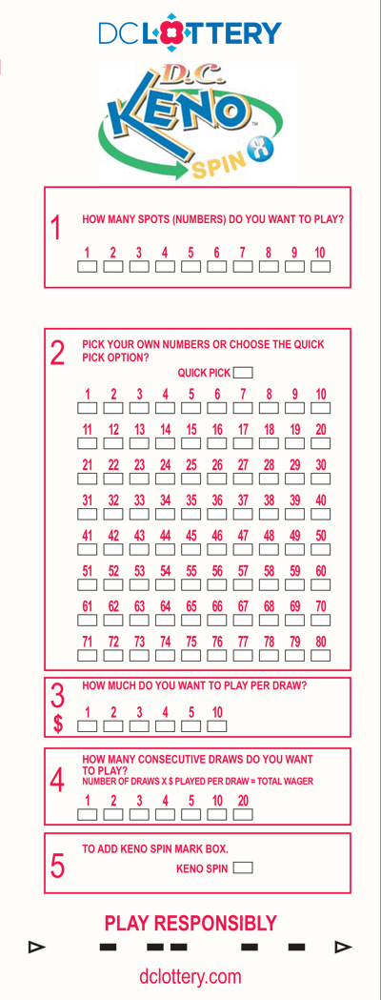
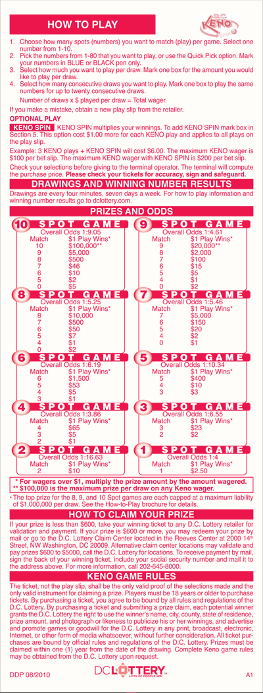

CS 240: Computer Science II
===========================

Homework 3
----------

Assigned: 2013-09-19

Due: 2013-09-23

### Reading

* Read chapter 5 in "Git"
* Review chapter 7 in "Practice"

### Programming

Keno slips (see below) offer bettors both the payouts and the chances of
winning, given a particular number of spots wagered. Write a simulation that
tests these offered values.

Use random number generation to choose house picks (20 numbers picked 1-80)
and player picks (varies by game, picked 1-80). Run each game type over 1 million trials, with
reporting every 100,000 trials, and a summary at the end. Use 3 decimal places
for all percents, and 2 decimal places for odds.

    # Example output
    10-Spot Game (spots matched)Number of wins[Percentage%]Odds

    100,000:   (10)0[0.000%]N/A (9)43[0.043%]2325.58 .. (All)*[10.985%]9.10
    ..
    1,000,000: (10)5[0.000%]200000.00 .. (All)*[11.047%]9.05

    9-Spot Game ..

    ..

    1-Spot Game ..

All input must verified, with repeated prompts and/or graceful failure.

### Keno Slip
#### Front

#### Back

